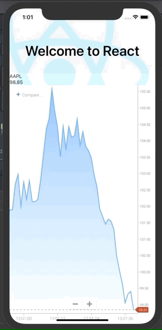
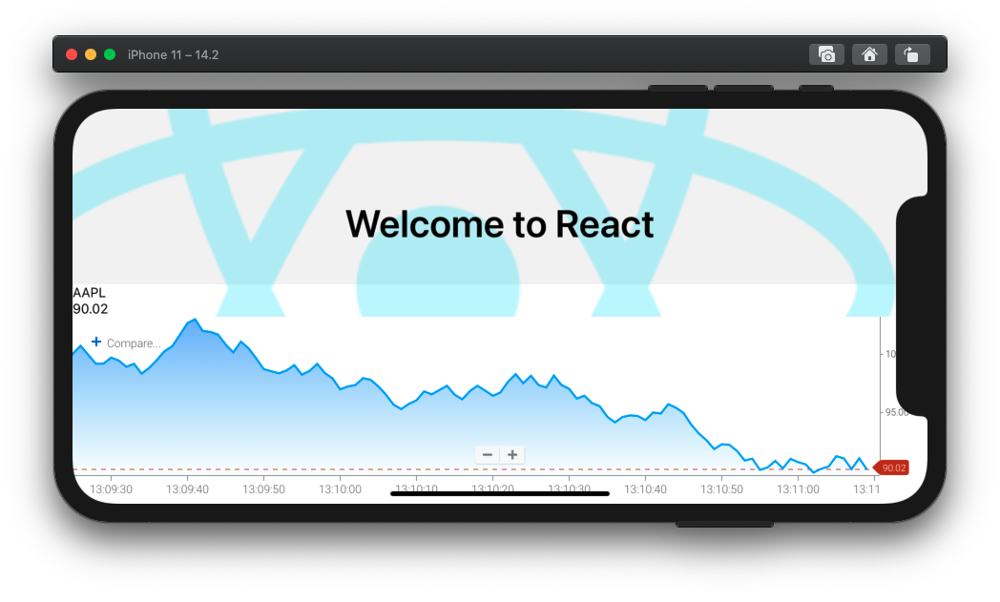

# Sample React Native Chart

## What This Is

This is a basic ChartIQ chart with connection to a React Native component. The plumbing is simplistic as a proof-of-concept to help you on your way and is not representative of production-level code.

Of note are the following:

1. This has been worked against iOS, not Android.
1. With that being said, the usage of the Mobile SDK is the same.
1. Please note that I personally am not an expert with React Native, so this codebase makes no prescriptions on code vis-à-vis React Native.

The top-left "AAPL" and ticking price are passed to the React component via postMessage when retriving information from the mobile bridge. Again, this is just a simple example. 

## Setup

1. `npm install`
1. `npm run chartiq`

`npm run chartiq` is just a convenience that I wrote to both start the Express webserver to serve up the webview as well as begin the iOS simulator. Please modify as needed or ignore it completely and run `npm start` in [web](./web) and `npm run ios` in the root.

## Documentation

https://documentation.chartiq.com

https://chartiq.readme.io/docs

## Contact

charting-solutions@chartiq.com